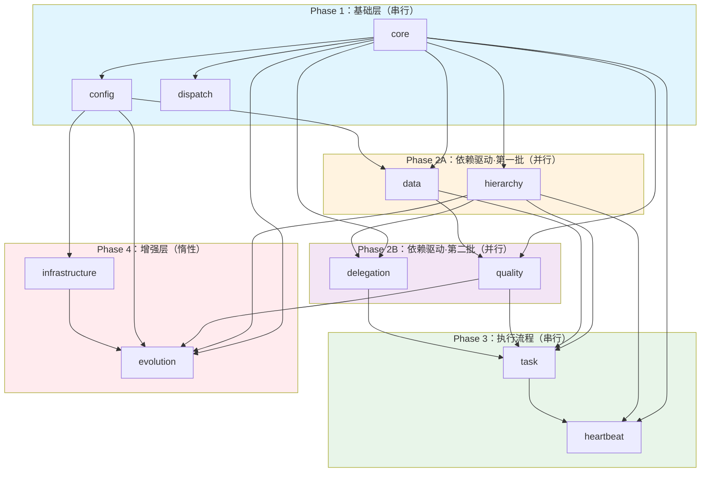

# Governance Core Skill - 人类文档

> **用途**：供人类开发者理解系统架构、快速上手
> **Agent 执行**：常规执行请使用 `SKILL.md`，仅在需要可视化依赖关系时读取本文档

---

## 快速上手

### 这是什么？

`governance-core` 是 OpenClaw 治理系统的核心 Skill，负责：
- Agent 启动时的引导加载
- 其他治理 Skill 的按需加载（依赖驱动）
- 失败处理和降级策略

### 文件结构

```
skills/openclaw-governance-core/
├── SKILL.md        # 执行协议（Agent 必读，~650 行）
├── README.md       # 本文档（人类文档）
└── DESIGN.md       # 设计文档（复杂边界情况时查阅）
```

### 何时读取哪个文件？

| 场景 | 读取文件 |
|------|----------|
| Agent 执行治理任务 | `SKILL.md` |
| 理解系统架构 | `README.md` |
| 调试复杂问题 | `DESIGN.md` |
| 查看演进历史 | `DESIGN.md` |

---

## 依赖图（可视化）



### 依赖关系说明

| 层级 | 模块 | 依赖 | 说明 |
|------|------|------|------|
| **L1** | core | 无 | 唯一基础层 |
| **L2** | config | core | 配置管理 |
| **L2** | dispatch | core | 意图路由 |
| **L2** | hierarchy | core | 层级管理 |
| **L2** | data | core, config | 数据治理 |
| **L2** | task | core, hierarchy, quality, data, delegation | 任务执行 |
| **L2** | heartbeat | core, hierarchy, task | 日常巡检 |
| **L3** | quality | core, data | 质量审核 |
| **L3** | delegation | core, hierarchy | 授权管理 |
| **L4** | infrastructure | core, config | 技术设施 |
| **L4** | evolution | core, hierarchy, quality, config, infra | 自我进化 |

---

## 核心路径变量

| 变量 | 值 | 说明 |
|------|-----|------|
| `$OPENCLAW_GOVERNANCE_DIR` | `.system/governance/current` | 治理文件运行目录（openclaw.json env 定义） |
| `$OPENCLAW_LOCAL_WORKSPACE` | 工作空间根目录 | Agent 工作区（openclaw.json env 定义） |

---

## 治理文件结构

```
.system/governance/current/
├── SOUL.md                    # 核心价值观
├── IDENTITY.md                # Agent 身份定义
├── HEARTBEAT.md               # 巡检协议
├── MISSION_BOARD.md           # 任务看板
├── USER.md                    # 用户信息
├── AGENTS.md                  # Agent 列表
├── config/                    # 配置文件
│   ├── globals.yaml           # 全局变量
│   ├── duty-mapping.yaml      # 职责映射表
│   ├── system/                # 系统级配置
│   │   ├── agents.yaml
│   │   ├── skills.yaml
│   │   ├── system-projects.yaml
│   │   ├── system-tasks.yaml
│   │   └── system-topics.yaml
│   └── user/                  # 用户级配置
│       ├── user-projects.yaml
│       ├── user-tasks.yaml
│       ├── user-topics.yaml
│       └── persons.yaml
├── decisions/                 # 决策库
│   └── HAROLD-DECISION-LIBRARY.md
├── lessons/                   # 教训库
│   └── LESSON-LEARN-*.md
└── projects/                  # 系统级项目目录
    ├── sys-gov/
    ├── sys-ops/
    ├── sys-agent/
    └── sys-data/
```

---

## 模式配置

| 模式 | 说明 | 加载 Skill 数 |
|------|------|---------------|
| **default** | 默认模式 - L1+L2 | 8 |
| **minimal** | 最小模式 - 仅 L1 | 4 |
| **full** | 完整模式 - L1-L3 全部 | 10 |

---

## 相关文档

| 文档 | 用途 |
|------|------|
| `SKILL.md` | 执行协议（Agent 必读） |
| `DESIGN.md` | 设计文档（复杂场景时查阅） |
| `INDEX.md` | 内容地图（不确定时查询） |

---

*版本: 6.0.0 | 更新: 2026-04-03 | 用途: 人类文档（依赖图、快速上手）*
