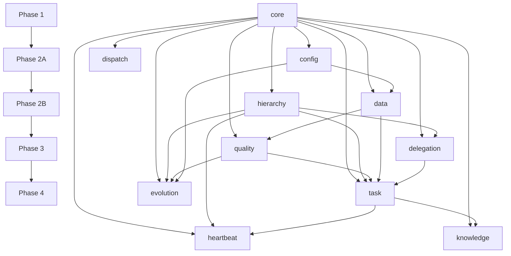

# Phase 序列详细说明

> **版本**: v7.0.0
> **更新**: 2026-04-22
> **引用**: governance-core SKILL.md §二

---

## 目录

1. [设计理念](#设计理念)
2. [Phase 1：基础层](#phase-1基础层)
3. [Phase 2A：第一批](#phase-2a第一批)
4. [Phase 2B：第二批](#phase-2b第二批)
5. [Phase 3：执行流程](#phase-3执行流程)
6. [Phase 4：增强层](#phase-4增强层)
7. [依赖图](#依赖图)
8. [超时配置](#超时配置)
9. [相关资源](#相关资源)

---

## 设计理念

### Phase 分层原则

1. **依赖驱动**：上游 Phase 必须完成才能进入下游 Phase
2. **串行启动**：Phase 1 必须串行（致命错误需立即终止）
3. **并行加载**：Phase 2A/2B 可并行（同一 Phase 内的模块无依赖）
4. **惰性触发**：Phase 4 惰性加载（不影响主流程）

### Phase 结构

```
Phase 1 (串行)
├── Step 1: governance-core
├── Step 2: governance-config
└── Step 3: governance-dispatch

Phase 2A (可并行)
├── Step 4a: governance-hierarchy
└── Step 4b: governance-data

Phase 2B (可并行，等 2A 完成)
├── Step 5a: governance-quality
└── Step 5b: governance-delegation

Phase 3 (串行)
├── Step 6: governance-task
├── Step 7: governance-heartbeat
└── Step 7a: governance-knowledge

Phase 4 (惰性)
└── Step 8: governance-evolution
```

---

## Phase 1：基础层

### 启动触发，串行执行

```
Phase 1：基础层（启动触发，串行）
─────────────────────────────────
Step 1  governance-core       无依赖
Step 2  governance-config     depends: core ✅
Step 3  governance-dispatch   depends: core ✅
└─ 失败处理：
   core 失败 → 终止启动（致命）
   config 失败 → 降级到内置 defaults，记录警告，继续
   dispatch 失败 → 终止启动（无法路由）
```

### Phase 1 屏障

```
━━━━━━━━━━━━━━━━━━━━━━━━━━━━━━━━━━━━━━━━
【Phase 1 → Phase 2A 屏障】
屏障条件：所有模块达到最终状态（success 或 degraded）
屏障语义：硬屏障（必须等待所有模块完成，包括降级完成）
━━━━━━━━━━━━━━━━━━━━━━━━━━━━━━━━━━━━━━━━
```

---

## Phase 2A：第一批

### 依赖驱动加载，可并行

```
Phase 2A：依赖驱动加载·第一批（可并行）
──────────────────────────────────────────
Step 4a governance-hierarchy  depends: core ✅
Step 4b governance-data       depends: core, config ✅
└─ 失败处理：
   hierarchy 失败 → 标记为 failed，记录错误，进入 Phase 2B 前广播状态
   data 失败 → 标记为 degraded（只读模式），记录警告，进入 Phase 2B 前广播状态
```

### Phase 2A 屏障

```
━━━━━━━━━━━━━━━━━━━━━━━━━━━━━━━━━━━━━━━━
【Phase 2A → Phase 2B 屏障】
屏障条件：
  1. 所有 2A 模块达到最终状态（success / degraded / failed）
  2. 广播 2A 健康状态快照给所有 2B 模块
     - hierarchy_status: success|failed
     - data_status: success|degraded|failed
屏障语义：硬屏障 + 状态广播（2B 模块必须在初始化时读取快照）
━━━━━━━━━━━━━━━━━━━━━━━━━━━━━━━━━━━━━━━━
```

---

## Phase 2B：第二批

### 依赖驱动加载，可并行，等 2A 完成

```
Phase 2B：依赖驱动加载·第二批（可并行，等 2A 完成）
────────────────────────────────────────────────────
Step 5a governance-quality    depends: core, data ✅
Step 5b governance-delegation depends: core, hierarchy ✅
└─ 初始化要求：
   quality 必须读取 data_status 快照，如 degraded 则进入只读审核模式
   delegation 必须读取 hierarchy_status 快照，如 failed 则无法启动
└─ 失败处理：
   quality 失败 → 标记为 degraded，带警告继续（task 可创建，不可闭环）
   delegation 失败 → 标记为 failed，阻止 task 加载（安全风险）
```

### Phase 2B 屏障

```
━━━━━━━━━━━━━━━━━━━━━━━━━━━━━━━━━━━━━━━━
【Phase 2B → Phase 3 屏障】（P0-3 增强：软降级检测）⭐
屏障条件：
  1. 所有 2B 模块达到最终状态（success / degraded / failed）
  2. 检查阻塞条件：
     - hierarchy == failed → 阻止 Phase 3（严重降级）
     - delegation == failed → 阻止 Phase 3（安全风险）
  3. **软降级检测**（新增）：
     - hierarchy: 非 failed AND Project 树可读
     - delegation: 非 failed AND 授权规则文件完整
     - quality: 非 failed（允许带警告通过）
  4. **未通过阻塞也未通过软降级 → 带 warning 继续**
屏障语义：条件屏障（满足阻塞条件时终止；软降级不通过时 degraded 继续 + warning）
━━━━━━━━━━━━━━━━━━━━━━━━━━━━━━━━━━━━━━━━
```

---

## Phase 3：执行流程

### 意图/定时触发，串行执行

```
Phase 3：执行流程（意图/定时触发，串行）
─────────────────────────────────────────
Step 6  governance-task       depends: core, hierarchy, quality, data, delegation ✅
Step 7  governance-heartbeat  depends: core, hierarchy, task ✅
Step 7a governance-knowledge  depends: core, task ✅  # 知识沉淀出口
├─ 注册定时器：Phase 3 完成后立即注册
└─ 首次执行：task 就绪后才允许触发
└─ 失败处理：
   task 失败 → heartbeat 不加载，记录错误
   heartbeat 失败 → 不影响 task，记录错误
   knowledge 失败 → 不影响主流程，记录警告
```

### Phase 3 屏障

```
━━━━━━━━━━━━━━━━━━━━━━━━━━━━━━━━━━━━━━━━
【Phase 3 → Phase 4 屏障】
屏障条件：Phase 3 完成（无论成功或降级）
屏障语义：软屏障（Phase 4 惰性加载，不影响主流程）
━━━━━━━━━━━━━━━━━━━━━━━━━━━━━━━━━━━━━━━━
```

---

## Phase 4：增强层

### 显式触发，惰性加载

```
Phase 4：增强层（显式触发，惰性加载）
─────────────────────────────────────
Step 8  governance-evolution       depends: core, hierarchy, quality, config ✅
└─ 触发时机：用户明确请求时才加载
└─ 失败处理：单独失败，不影响其他层，记录警告
└─ 重试策略：最多重试 2 次，失败后向用户报告
```

---

## 依赖图



---

## 超时配置

### Tier 分组

| Tier | 模块 | 超时阈值 | 说明 |
|------|------|----------|------|
| **Tier 1** | core | 2s | 快速探针，应立即完成 |
| **Tier 1** | dispatch | 3s | 路由表加载 |
| **Tier 2** | config | 5s | 文件 I/O |
| **Tier 2** | hierarchy | 8s | agents.yaml 解析 |
| **Tier 2** | data | 5s | 文件 I/O |
| **Tier 2** | delegation | 5s | 文件 I/O |
| **Tier 3** | quality | 10s | 模板校验 |
| **Tier 3** | task | 10s | 模板校验 |
| **Tier 3** | heartbeat | 3s | 定时器注册 |

### Phase 总超时

| Phase | Tier 超时 | Phase 总超时 | 超时后行为 |
|-------|-----------|--------------|------------|
| Phase 1 | Tier 1 阈值 | 60s | 终止启动（无软失败，无重试） |
| Phase 2A | Tier 2 阈值 | 90s | 标记 failed，继续评估 |
| Phase 2B | Tier 2 阈值 | 90s | 标记 failed/degraded |
| Phase 3 | Tier 3 阈值 | 120s | 警告，允许惰性加载 |

---

## 相关资源

- [SKILL.md]({baseDir}/SKILL.md) - 核心运行机制
- [barrier-design.md]({baseDir}/references/barrier-design.md) - 屏障设计详细文档
- [failure-matrix.md]({baseDir}/references/failure-matrix.md) - 失败传播矩阵
- [pdca-workflow.md]({baseDir}/references/pdca-workflow.md) - PDCA 工作流说明

---

*文档版本: v7.0.0 | 更新: 2026-04-22*